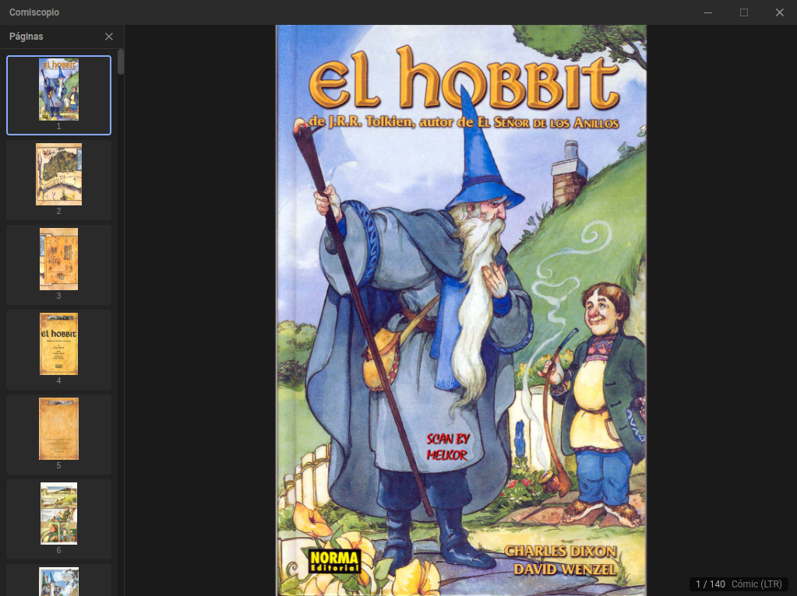
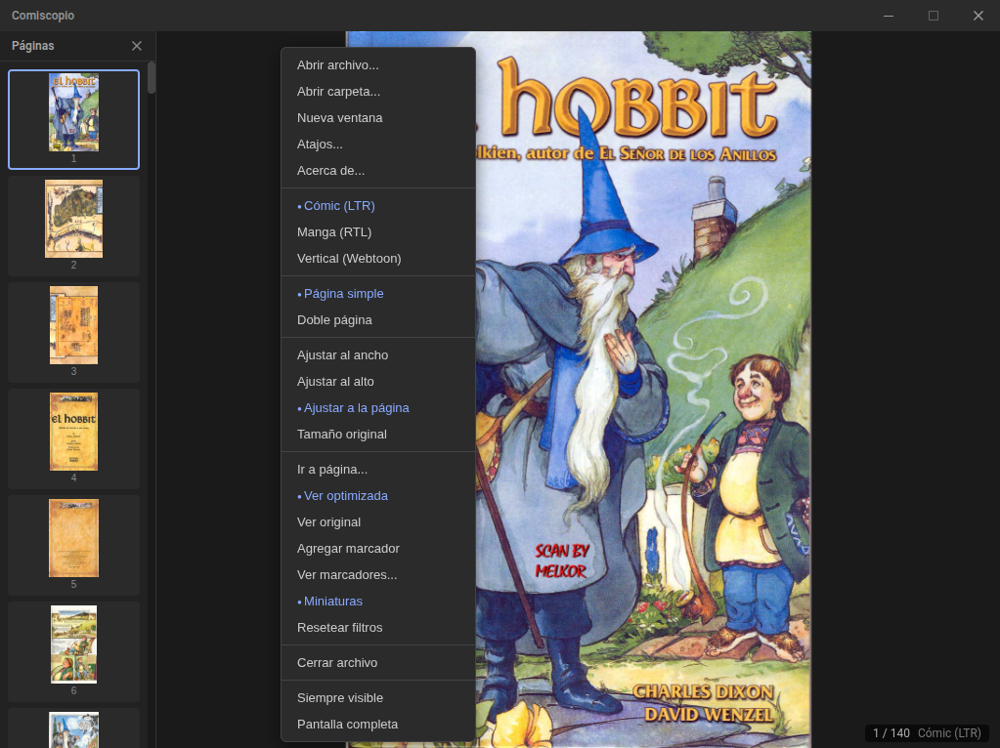
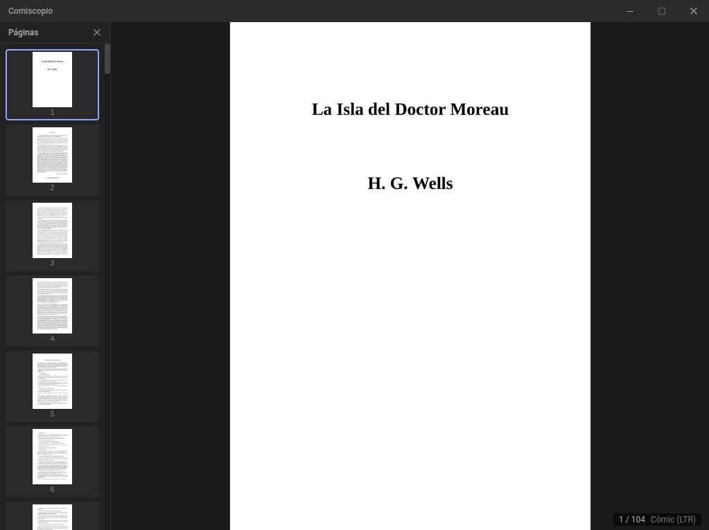

# Comiscopio

Visor de cómics y manga para escritorio. Soporta archivos comprimidos (CBZ, CBR, CB7), documentos (PDF, EPUB, DjVu, XPS) y carpetas de imágenes, con énfasis en rendimiento y archivos grandes.

[](LICENSE)
[](#)
[](#)



---

## Características

- **Modos de lectura:** LTR (cómic occidental), RTL (manga), Vertical (webtoon/scroll)
- **Página simple y doble** con detección automática de páginas de doble ancho
- **Zoom y pan** con rueda del ratón y arrastre; cuatro modos de ajuste (ancho, alto, página, original)
- **Miniaturas** con panel lateral de navegación rápida
- **Filtros de imagen:** brillo y contraste ajustables en tiempo real
- **Marcadores** por archivo con nombre y salto directo a página
- **Persistencia:** progreso de lectura, marcadores y configuración guardados en SQLite
- **Multi-ventana** y modo siempre visible (*always on top*)
- **Atajos de teclado configurables** (28 acciones)
- **Workers nativos en C++** para extracción y rasterizado eficiente
- **Ventana deslizante de páginas:** archivos de cientos de páginas sin agotar la memoria

---

## Formatos soportados

| Formato | Extensiones | Backend |
|---|---|---|
| Comic ZIP | `.cbz`, `.zip` | libarchive |
| Comic RAR | `.cbr`, `.rar` | libunrar |
| Comic 7-Zip | `.cb7`, `.7z` | 7-Zip SDK |
| Comic TAR | `.cbt`, `.tar`, `.tgz` | libarchive |
| PDF | `.pdf` | MuPDF |
| EPUB | `.epub` | MuPDF |
| DjVu | `.djvu`, `.djv` | MuPDF |
| XPS | `.xps` | MuPDF |
| Carpeta de imágenes | jpg, png, webp, avif, gif, bmp, tiff | — |

---

## Capturas de pantalla

| Leyendo un cómic | Menú de opciones | Leyendo un PDF |
|:---:|:---:|:---:|
|  |  |  |

---

## Requisitos

### Ejecutar la aplicación (AppImage)

El AppImage es autocontenido (workers nativos y todas sus dependencias incluidas), pero requiere FUSE para montarse:

```bash
sudo apt install libfuse2   # Ubuntu 22.04+ / Debian 12+
```

Como alternativa sin FUSE, descarga el `tar.gz`, extrae y ejecuta el binario directamente:

```bash
tar -xzf comiscopio-0.1.0.tar.gz
./comiscopio-0.1.0/comiscopio
```

### Compilar desde código fuente

- **Node.js 24+**
- **Linux — dependencias de sistema:**

```bash
sudo apt install \
  libvips-dev libarchive-dev libunrar-dev \
  libmupdf-dev libjbig2dec0-dev libgumbo-dev libmujs-dev \
  libfreetype-dev libharfbuzz-dev libopenjp2-7-dev libjpeg-dev \
  nlohmann-json3-dev cmake pkg-config
```

---

## Compilar y ejecutar

```bash
# Instalar dependencias Node
npm install

# Modo desarrollo (Angular dev server + Electron con hot-reload)
npm start

# Build local completo (workers nativos + Angular + Electron)
npm run build

# Regenerar bundle portable de workers nativos
npm run build:portable

# Validación local completa
npm test

# Empaquetar directorio Linux unpacked
npm run pack

# Empaquetar para Linux (AppImage + tar.gz)
npm run dist:linux

# Empaquetar para Windows (portable + zip)
npm run dist:win
```

`npm run build:portable` compila los workers nativos en un contenedor Docker Ubuntu 22.04, enlazando o empaquetando las dependencias necesarias en `native/vendor/linux-x64/`. Ese bundle portable es el que consumen los tests funcionales locales y los empaquetados Linux.

### Flujo recomendado

```bash
# Desarrollo
npm start

# Verificar que nada se rompió
npm test

# Generar artefactos Linux de distribución
npm run dist:linux
```

---

## Tests

### Tests unitarios (Vitest)

Cubren la lógica crítica de TypeScript: parseo del protocolo worker → bridge, estado del lector, caché de páginas y el manejador de eventos del visor.

```bash
npm run test:unit   # ejecutar una vez
npm run test:watch  # modo watch (re-ejecuta al guardar)
```

Salida esperada:

```
 ✓ test/unit/bridge-parser.test.ts       (25 tests)
 ✓ test/unit/reader-state.test.ts        (22 tests)
 ✓ test/unit/page-cache.test.ts          (16 tests)
 ✓ test/unit/viewer-event-handler.test.ts (16 tests)

 Test Files  4 passed (4)
      Tests  79 passed (79)
```

### Tests funcionales de workers

Arrancan los workers nativos reales contra fixtures sintéticos y verifican eventos de protocolo, archivos de salida, miniaturas y el flujo focus/ready.

Para validación local completa, el flujo recomendado es:

```bash
npm test
```

Eso ejecuta:

- build local de workers + app
- tests unitarios (`vitest`)
- tests nativos (`ctest`)
- rebuild del bundle portable
- tests funcionales contra `native/vendor/linux-x64`

Los tests funcionales están diseñados para ejecutarse en containers de distintas distribuciones (Ubuntu 20.04, 22.04, 24.04, Debian, Fedora, etc.) y verificar que los workers nativos funcionan correctamente en cada entorno.

#### Paso 1 — Fixtures

Los fixtures están incluidos en el repositorio (`test/fixtures/`), no hace falta generarlos. Solo es necesario regenerarlos si se modifica `generate-fixtures.py`:

```bash
python3 -m venv test/.venv
source test/.venv/bin/activate
pip install fpdf2
python3 test/fixtures/generate-fixtures.py
```

Requiere `7z` en el sistema y opcionalmente `rar` (para CBR).

Los fixtures regenerados se versionan en el repositorio y se consumen directamente tanto en local como en CI.

#### Paso 2 — Ejecutar la matriz de distros (recomendado)

```bash
npm run pack
npm run test:functional
```

Las distros están definidas en `test/workers/distros.txt`.

**Sin `--pull` (por defecto):** solo usa imágenes ya presentes en el cache local de Docker. Las que no estén disponibles se marcan como `SKIP` — no descarga nada, funciona sin conexión.

**Con `--pull` (primera vez o actualización):** descarga las imágenes que falten del cache y luego ejecuta los tests. Las dos acciones ocurren en el mismo comando:

```bash
npm run test:functional -- --pull
```

Salida esperada:

```
  Image                           Result  Time
  ──────────────────────────────────────────────────
  ubuntu:22.04                    PASS    41s
  ubuntu:24.04                    PASS    39s
  debian:12                       PASS    44s
  debian:13                       PASS    46s
  fedora:40                       PASS    52s
  fedora:41                       PASS    50s
  fedora:42                       PASS    49s
  opensuse/leap:15.6              PASS    51s
  opensuse/tumbleweed             PASS    54s
  ──────────────────────────────────────────────────
  PASS: 9   FAIL: 0   SKIP: 0
```

> Distros excluidas (glibc < 2.33): ubuntu:20.04, debian:11, opensuse/leap:15.4, opensuse/leap:15.5.

Para agregar o quitar distros, editar `test/workers/distros.txt`.

#### Paso 2 (alternativa) — Ejecutar localmente sin Docker

```bash
bash test/workers/run-worker-tests.sh
```

El script detecta automáticamente los binarios en `native/vendor/linux-x64/bin/`.
Si acabas de cambiar código nativo, regenera antes el bundle portable:

```bash
npm run build:portable
bash test/workers/run-worker-tests.sh
```

**Flags disponibles (`run-distro-tests.sh`):**

| Flag | Descripción |
|---|---|
| `--pull` | Descarga imágenes no presentes en cache local |
| `--only-archive` | Solo tests de archive worker (cbz/cbr/cb7/cbt) |
| `--only-doc` | Solo tests de doc-worker (pdf/epub) |
| `--keep-output` | Conserva la salida del worker para inspección |
| `--native-dir <path>` | Ruta explícita al directorio con `bin/` y `lib/` |
| `--fixtures-dir <path>` | Ruta explícita al directorio de fixtures |
| `--distros-file <path>` | Lista de imágenes alternativa a `distros.txt` |

**Salida esperada:**

```
========================================
 Archive Worker — Basic Extraction Tests
========================================

--- cbz_5pages ---
  [PASS] cbz_5pages: archive event
  [PASS] cbz_5pages: manifest.json valid
  [PASS] cbz_5pages: page 0 processed (000000.jpg)
  [PASS] cbz_5pages: 5 thumbnails generated
...

========================================
  OVERALL: PASS
```

### Verificación de dependencias (portabilidad)

Comprueba que los binarios nativos no tienen dependencias de sistema inesperadas (todo debe estar en `lib/` o ser glibc/libstdc++):

```bash
npm run build:portable
bash test/ldd/check-deps.sh native/vendor/linux-x64
```

Salida esperada (todas las libs clasificadas como `[BUNDLED]` o `[SYSTEM-OK]`):

```
=== check-deps: comiscopio-worker ===
  [SYSTEM-OK]  libc.so.6                           /lib/x86_64-linux-gnu/libc.so.6
  [SYSTEM-OK]  libstdc++.so.6                      /lib/x86_64-linux-gnu/libstdc++.so.6
  [BUNDLED]    libvips.so.42                       /native/lib/libvips.so.42
  ...
  RESULT: 0 missing, 0 unexpected

=== OVERALL: PASS (0 missing, 0 unexpected) ===
```

---

## Uso básico

1. Abre un archivo con **Ctrl+O**, desde el menú contextual o arrastrándolo a la ventana.
2. Navega con las **flechas del teclado**, la **rueda del ratón** o el panel de miniaturas (**T**).
3. Cambia el modo de lectura con **R** (LTR → RTL → Vertical).
4. El progreso se guarda automáticamente al cerrar.

---

## Atajos de teclado

| Atajo | Acción |
|---|---|
| `Ctrl+O` | Abrir archivo |
| `Ctrl+W` | Cerrar archivo |
| `Ctrl+N` | Nueva ventana |
| `Ctrl+G` | Ir a página... |
| `→` / `←` | Página siguiente / anterior |
| `PageDown` / `PageUp` | Página siguiente / anterior (alt) |
| `Espacio` | Página siguiente |
| `Home` / `End` | Primera / última página |
| `Ctrl+=` / `Ctrl+-` | Acercar / alejar |
| `Ctrl+0` | Restablecer zoom |
| `Shift+↑` / `Shift+↓` | Subir / bajar brillo |
| `Shift+→` / `Shift+←` | Subir / bajar contraste |
| `I` | Restablecer filtros |
| `R` | Cambiar modo de lectura |
| `D` | Alternar página simple / doble |
| `F` | Cambiar ajuste de imagen |
| `T` | Mostrar / ocultar miniaturas |
| `B` | Agregar marcador |
| `F11` | Pantalla completa |

Todos los atajos son reconfigurables desde el menú → Atajos.

---

## Licencias

Comiscopio se distribuye bajo **[AGPL-3.0-or-later](LICENSE)**.

Las dependencias de terceros tienen sus propias licencias:

| Componente | Licencia | Notas |
|---|---|---|
| [MuPDF](https://mupdf.com) (Artifex) | AGPL-3.0 | Licencia dual; se usa la rama open source, compatible con AGPL-3.0 |
| [libunrar](https://www.rarlab.com/rar_add.htm) | Freeware propietario | Solo descompresión; redistribución sin modificación permitida; no compatible con GPL |
| [libvips](https://www.libvips.org) | LGPL-2.1-or-later | |
| [libarchive](https://www.libarchive.org) | BSD-2-Clause | |
| [Electron](https://www.electronjs.org) | MIT | |
| [Angular](https://angular.dev) | MIT | |
| [better-sqlite3](https://github.com/WiseLibs/better-sqlite3) | MIT | |
| [nlohmann/json](https://github.com/nlohmann/json) | MIT | |

**MuPDF:** Artifex ofrece MuPDF bajo licencia dual (AGPL-3.0 u comercial). Comiscopio usa la rama AGPL-3.0. Si deseas integrar Comiscopio en un producto propietario, necesitarás adquirir una licencia comercial de Artifex.

**libunrar:** La licencia de UnRAR permite descompresión libre pero prohíbe crear software de compresión RAR y es incompatible con GPL. Por este motivo algunas distribuciones (Fedora, Debian main) no incluyen libunrar en sus repositorios oficiales.

---

## Contribuir

Las contribuciones son bienvenidas. Abre un [issue](https://github.com/Rigo85/Comiscopio/issues) para reportar bugs o proponer mejoras, o un pull request con tus cambios.
